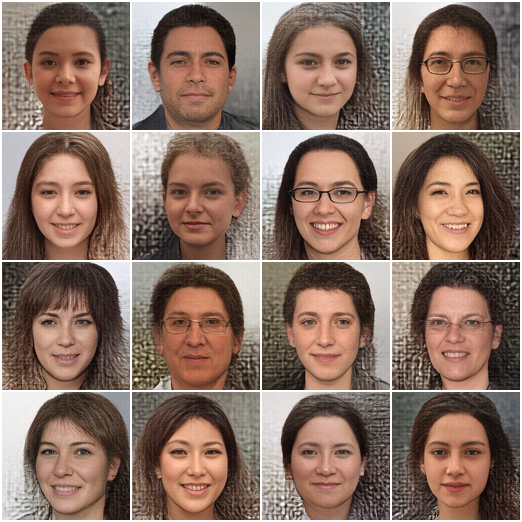

# NF Synth

*The present code is in prototype stage.*

This repository contains the code for the MSc Thesis: *"Normalising Flow: Seeing Latent Space"*. Written and coded by Michael Accetto and supervised by Jakub Tomczak.

## Project

It is intended to compress images with continuous, Normalising Flow (NF) generative models.

The NF architectures are: 

	- Glow [link to paper](https://arxiv.org/abs/1807.03039)
	- Real-NVP (*deprecated*, [link to paper](https://arxiv.org/abs/1605.08803))

## Usage 

Network training:

	$ python3 train.py [--config /path/to/config.yml]

Compression visualisation:

	$ python3 reduce.py [--config /path/to/config.yml]

Similarity analysis:

	$ python3 similarity.py [--config /path/to/config.yml]

## Models

### Synthesizer

Abstraction over step based compression module comprising:

- Normalising Flow Architecture (Glow or ~Real NVP~)
- Principal Component Analysis (PCA)
- Uniform Manifold Approximation Projection (UMAP, optional)

`Synthesizer` is a scikit compliant transformer class implementing the methods: `fit`, `transform`,
`inverse_transform`, `fit_transform`.

A more detailed description will be soon pushed to `main`.

## Architectures

### Glow

Trained model on FFHQ128 and celebA128 datasets. 
The model contains a learned prior, possibility to train additive and affine coupling layer variants,
exponential function instead of sigmoid. 

Progression of samples during training. Sampled once per 100 iterations during training.
